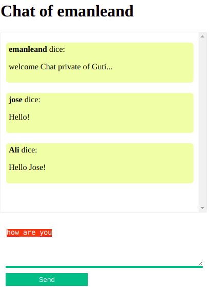

# Chat
## Description
Project under construction
## Tech
This is a project is developed with the following technologies
- [NodeJS] - evented I/O for the backend!

## Instalation
Require NodeJS v12+. Perform the following steps
- Clone the repo
- Install npm dependencies: npm install

